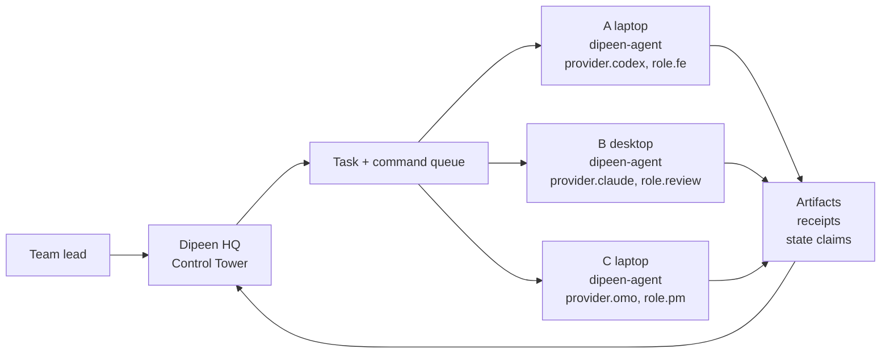

# Dipeen OS

<p align="center">
  <strong>The local-first control plane where AI agents become accountable teammates.</strong>
</p>

<p align="center">
  <a href="https://github.com/cjw0076/dipeen-os"></a>
  <a href="./LICENSE"></a>
  
  
  
</p>

<p align="center">
  Open one workspace, invite your teammates and their local Claude / Codex / OMO / Gemini agents,
  assign work, and review the <strong>evidence</strong> before anything risky happens.
</p>

---

Dipeen is the open-source control plane for agent-native teams. It doesn't replace Claude, Codex,
OMO, Gemini, or your local CLIs — it connects each person's `dipeen-agent` to one shared workspace
and tracks who owns what, which worker may run it, what evidence came back, and which actions need
human permission.

> **Honest scope.** Dipeen assigns work, renders local-agent prompts, and collects evidence from
> local execution. **It does not auto-drive your agents yet.** A human (or an opt-in worker loop)
> still runs each agent locally; Dipeen handles routing, permission gates, and evidence.

```text
team lead / host
  Dipeen Control Tower
    rooms · tasks · command queue · permissions · artifacts · memory

teammate machines
  dipeen-agent
    provider.claude / provider.codex / provider.omo / provider.gemini
    local repo + local credentials + local execution
```

## What Dipeen actually does

- **One office for humans and agents** — work is assigned, tracked, and reviewed in one room.
- **Distributed execution, zero core execution** — the Core never runs a provider CLI. Workers
  pull commands and run them locally with their own keys.
- **Capability routing** — a command reaches only workers that advertise the required capabilities.
- **Evidence-first completion** — a task isn't "done" because an agent said so. Diffs, receipts,
  and test reports are captured and shown as **✓ Verified** (re-checked by Dipeen) or **⚑ Reported**
  (claimed by the worker).
- **Permissioned action** — push, deploy, PR, and other risky steps become permission requests and
  default to `dry_run` receipts until a human approves.
- **Org memory** — useful decisions and outcomes can become reviewable team memory candidates.

## 60-second proof (no Docker, no API key)

This runs a deterministic dogfood loop end to end — capability-routed workers, a false "done" that
needs retry, a verified done, a `git.commit` that becomes a `dry_run` receipt, and a decision that
becomes a pending memory candidate.

```bash
git clone https://github.com/cjw0076/dipeen-os.git
cd dipeen-os
pip install -e api          # installs the `dipeen` command
dipeen demo
```

No keys are read and nothing is executed for real — it's the canonical loop on deterministic data.

## Quick start — open a real workspace

```bash
# 1. Host: clone + install + open the HQ
git clone https://github.com/cjw0076/dipeen-os.git
cd dipeen-os
pip install -e api
dipeen open --dev          # boot HQ locally with uvicorn (omit --dev to use Docker)
```

`dipeen open` prints your workspace, a fresh invite code, the next actions, and the Control Tower URL:

```text
Dipeen workspace is open.

Workspace:    your-team
Invite code:  AB12-CD34   (expires ...)

Next actions:
  /dipeen expose this session          (public link — asks for your approval)
  /dipeen invite teammate
  /dipeen assign cap:claude "review the README"

Local Control Tower:
  http://localhost:3000
```

```bash
# 2. Teammate: join from another machine with the command `dipeen open` printed
pip install -e agent-client       # installs the `dipeen-agent` command
dipeen-agent join AB12-CD34 --api-url http://<host>:8000
```

```bash
# 3. Assign work (slash, or natural language, via the one control intent)
dipeen-agent slash '/dipeen assign cap:claude "fix the login redirect bug"'
#   → proposes a task; approve it to dispatch to a matching worker
```

```bash
# 4. Teammate runs it locally (semi-auto handoff runner)
dipeen-agent task next             # lease the next command assigned to you
dipeen-agent task prompt           # render the prompt to .dipeen/prompts/<runner>/<id>.md
#   ... run your Claude / Codex / OMO agent on that prompt ...
dipeen-agent task submit           # submit result.md + git diff as evidence
```

```bash
# 5. Host: review evidence in the Control Tower, then close the session
#    (open http://localhost:3000 → diffs, receipts, artifacts)
dipeen close                       # tears down any public tunnel (HQ stays up)
```

> **Two ways a worker runs.** `dipeen-agent task next|prompt|submit` is the **semi-auto handoff
> runner** — a human runs the agent and submits evidence. `dipeen-agent worker` is the **pull loop**
> that can execute a matching provider CLI automatically if the runner and key are present. Both
> report the same evidence; pick the level of autonomy you trust.

To expose the HQ on a public link for a remote demo or a lecture room:

```bash
dipeen open lecture          # owner-approved public Cloudflare tunnel + invite; Ctrl+C closes it
```

## Architecture



The Core orchestrates; it never executes. Each worker pulls only the commands whose required
capabilities it advertises, runs them on its own machine with its own credentials, and returns
artifacts. Risky actions stop at a permission gate first.

## Capability routing

A command is delivered only when:

```text
command.required_capabilities <= worker.capabilities
```

Use namespaced capability tokens so routing stays explainable:

| Token | Meaning | Example |
| --- | --- | --- |
| `provider.<name>` | Which local runner this worker can use | `provider.codex`, `provider.claude` |
| `role.<role>` | Team role | `role.fe`, `role.be`, `role.qa`, `role.review` |
| `user.<name>` | Specific teammate | `user.minjun` |
| `repo.<slug>` | Checked-out repo or project | `repo.ezmap-web` |
| `workspace.write` | Worker may edit its local workspace | `workspace.write` |

```bash
dipeen-agent worker \
  --capabilities provider.codex,role.fe,user.minjun,repo.ezmap-web,workspace.write
```

## Safety model

Dipeen is built around a strict host / worker boundary.

- **The Core executes nothing.** Workers run provider CLIs locally.
- **Keys stay local.** Provider API keys and CLI sessions never leave the worker machine (BYOK).
- **Risky actions become permission requests** before anything happens.
- **Approval ≠ side effects.** The default executor mode is `dry_run`; real execution requires an
  explicit opt-in (`DIPEEN_PERMISSION_EXECUTOR_MODE=local_execute`).
- **Public links are temporary.** `dipeen open lecture` asks for your approval, prints the tunnel,
  and tears it down on `dipeen close` / Ctrl+C. Run with worker auth on for public windows.

## Repository map

| Path | Purpose |
| --- | --- |
| `api/app/nat/` | Contracts, provider adapters, verifier, reconciler, command queue, permission executor |
| `api/app/nat/cli.py` | The `dipeen` host CLI — `open`, `close`, `demo`, `task`, `worker`, `permission` |
| `api/app/routers/` | HTTP control plane (intent, control, auth, team, worker, permission) |
| `agent-client/` | The `dipeen-agent` worker CLI — `join`, `task`, `worker`, `doctor` |
| `web/` | Dipeen Control Tower frontend |
| `docs/` | Architecture, security model, getting started, dogfood, roadmap |

## Documentation

- [docs/GETTING_STARTED.md](./docs/GETTING_STARTED.md) — practical local and team setup
- [docs/ARCHITECTURE.md](./docs/ARCHITECTURE.md) — control-plane architecture
- [docs/SECURITY_MODEL.md](./docs/SECURITY_MODEL.md) — trust boundaries and permission model
- [docs/CEILING.md](./docs/CEILING.md) — what Dipeen does **not** do yet (documented bounds)
- [docs/ROADMAP.md](./docs/ROADMAP.md) — public alpha and ecosystem roadmap
- [ALPHA_RUNBOOK.md](./ALPHA_RUNBOOK.md) — clone, run, verify, tunnel teardown checklist
- [INSTALL_FOR_AGENTS.md](./INSTALL_FOR_AGENTS.md) — onboarding contract for setup agents

## Contributing

Dipeen needs contributors in four extension surfaces:

- **provider adapters** for Claude, Codex, OMO, Hermes, Gemini, OpenCode, and local tools;
- **team blueprints** for release manager, security audit, research lab, startup squad, and QA desk;
- **verifiers** for pytest, Playwright, TypeScript, secret scans, policy checks, and PR evidence;
- **Control Tower UX** for live team work, permission review, artifacts, memory, and worker health.

## License

MIT
