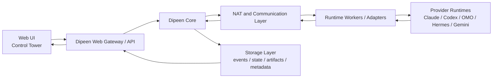

# Architecture

Dipeen OS is an organization control plane for distributed AI agent teams.

It does not replace Claude, Codex, OMO, Hermes, Gemini, or local tools. Those
systems execute or remember. Dipeen coordinates, verifies, gates, and reconciles.

## Category

```text
Provider CLI
  -> harness wrapping such as OMO or Hermes
  -> Dipeen team-base wrapping
  -> Web UI control-plane surface
```

Dipeen is the source of truth for command, event, artifact, permission, memory,
and reconciled state. Provider output is a claim until Dipeen verifies it.

## System Diagram



## Core Resources

`Command`

- `run.start`
- `run.stop`
- `task.assign`
- `permission.execute`
- `memory.promote`

`Event`

- `agent.started`
- `artifact.produced`
- `state.claimed`
- `state.reconciled`
- `permission.requested`

`Artifact`

- `code_patch`
- `file_change_set`
- `test_report`
- `review_result`
- `pr_reference`

Other canonical resources:

- `StateClaim`: provider-reported state before reconciliation
- `PermissionRequest`: a request Dipeen must approve or reject
- `MemoryCandidate`: a proposed organization memory item

## Layers

### Web Gateway / API

The Web UI reads canonical state through REST and uses WebSocket events for
invalidation.

Primary alpha APIs:

- `GET /api/control-plane/summary`
- `GET /api/runs`
- `GET /api/runs/{run_id}`
- `GET /api/events?task_id=&run_id=&tail=`
- `GET /api/artifacts?task_id=&run_id=&type=`
- `GET /api/permissions?status=requested`
- `POST /api/permissions/{id}/approve`
- `POST /api/permissions/{id}/reject`
- `GET /api/memory-candidates?status=pending`
- `POST /api/memory-candidates/{id}/promote`
- `POST /api/memory-candidates/{id}/reject`

### Dipeen Core

Core owns:

- task and run orchestration
- discussion and decision proposals
- permission ledger
- verifier and reconciler
- event and artifact ingestion
- memory candidate queue

Core never trusts provider output by default. Provider output is normalized,
verified, and reconciled.

### NAT And Communication Layer

NAT means Normalized Agent Translation.

It turns provider-specific behavior into canonical Dipeen resources:

- outbound commands to workers
- inbound events and artifacts
- state claims
- permission execution receipts
- memory proposals

The network model is outbound-first so workers can run behind NAT without router
port forwarding.

### Runtime Workers / Adapters

Workers run on laptops, servers, or cloud hosts. They pull work, execute local
tools, and upload evidence.

Adapters include:

- Claude Code style workers
- Codex CLI workers
- OMO/opencode harness workers
- Hermes memory/skill workers
- Gemini or OpenAI-compatible workers
- local deterministic tools

### Storage Layer

Storage separates append-only evidence from materialized views:

- Event log: append-only activity stream
- State store: reconciled state for fast UI reads
- Artifact store: patches, reports, receipts, PR refs
- Metadata DB: teams, agents, runs, permissions, memory candidates

## Safety Invariant

Risky side effects are commands, not direct Core actions.

Approval creates `permission.execute`. A worker processes it according to its
configured executor mode:

- `dry_run`: produce `would_execute` receipt only
- `manual_handoff`: tell a human what to execute
- `local_execute`: execute allowlisted actions locally

Default is `dry_run`.

## Web UI Surfaces

All pages should read the same canonical state:

- `/` and `/app`: Control Tower overview
- `/dashboard`: Run Workbench
- `/meeting/[id]`: planning room, brief, decision proposals, task waves
- `/onboarding`: launcher, BYOK, NAT, workspace setup checks
- `/office`: visual overlay over agents, tasks, runs, and activity
- `/graph`: graph overlay over canonical project and team state

No page should maintain a separate fake activity model unless
`NEXT_PUBLIC_DEMO_MODE=true`.
